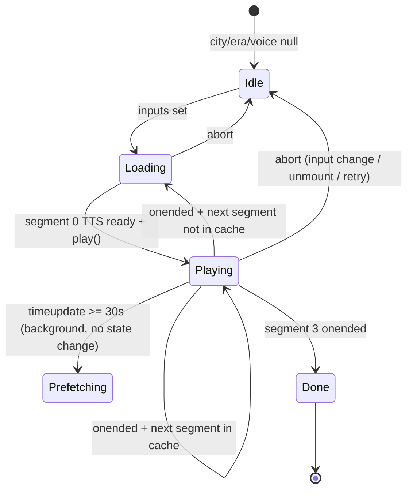

# Design Document: Progressive Documentary Audio

## Overview

This feature replaces the current "synthesise all 4 segments upfront" approach in Documentary mode with a **progressive loading strategy**. Groq text generation still produces all 4 segments at once (cheap, fast), but ElevenLabs TTS synthesis is deferred: only segment 0 is synthesised before playback begins. Subsequent segments are prefetched in the background at the 30-second mark of the currently playing segment, so they are ready before the current one ends.

The result is a significantly faster time-to-first-audio and zero wasted API credits on segments the user never reaches.

**Target playback structure:** 4 segments × ~40 seconds each = ~2 min 40 sec total.

---

## Architecture

The change is confined to two files:

```
src/services/documentaryService.ts   ← add synthesiseSegment(), update Groq prompt, refactor synthesiseDocumentaryAudio()
src/hooks/useDocumentary.ts          ← rewrite progressive playback logic
```

No new files, no new dependencies, no changes to the UI layer.

### Data Flow

```mermaid
sequenceDiagram
    participant Hook as useDocumentary
    participant Service as documentaryService
    participant Groq
    participant EL as ElevenLabs TTS
    participant Audio as HTMLAudioElement

    Hook->>Service: generateDocumentaryScript(city, era)
    Service->>Groq: chat.completions (4 segments, ~85 words each)
    Groq-->>Service: "seg0 --- seg1 --- seg2 --- seg3"
    Service-->>Hook: string[4]

    Hook->>Service: synthesiseSegment(segments[0], voiceId)
    Service->>EL: textToSpeech.convert(seg0)
    EL-->>Service: audio stream
    Service-->>Hook: objectURL[0]

    Hook->>Audio: audio.src = objectURL[0]; audio.play()
    Note over Hook: isLoading=false, isPlaying=true

    Audio->>Hook: timeupdate (currentTime >= 30s)
    Hook->>Service: synthesiseSegment(segments[1], voiceId)  [background]
    Service->>EL: textToSpeech.convert(seg1)
    EL-->>Service: audio stream
    Service-->>Hook: objectURL[1]  → stored in segmentCache[1]

    Audio->>Hook: onended (segment 0 done)
    Hook->>Audio: audio.src = segmentCache[1]; audio.play()

    Note over Hook: repeat for segments 2 and 3
```

---

## Components and Interfaces

### `documentaryService.ts` changes

#### Updated Groq prompt

The prompt word-count target changes from "100–180 words" to **"80–90 words"** per segment. The system prompt and separator format (`---`) remain the same.

#### New function: `synthesiseSegment`

```typescript
/**
 * Synthesises a single documentary segment via ElevenLabs TTS.
 * Returns an object URL pointing to the audio blob.
 * Throws AbortError immediately if signal is already aborted.
 * Retries up to 3 times on 429 rate-limit errors with exponential backoff.
 */
export async function synthesiseSegment(
  segment: string,
  voiceId: string,
  signal?: AbortSignal
): Promise<string>
```

Voice settings (stability, similarity_boost, style, use_speaker_boost, output_format) are identical to the current `synthesiseDocumentaryAudio` implementation — they move here.

#### Refactored `synthesiseDocumentaryAudio`

The existing function is kept for backward compatibility but delegates to `synthesiseSegment` internally:

```typescript
export async function synthesiseDocumentaryAudio(
  segments: string[],
  voiceId: string,
  signal?: AbortSignal
): Promise<string[]>
// Calls Promise.all(segments.map(s => synthesiseSegment(s, voiceId, signal)))
// Filters out nulls, throws if all fail
```

This eliminates duplicated retry and voice-settings logic.

---

### `useDocumentary.ts` rewrite

#### State and refs

| Name | Type | Purpose |
|---|---|---|
| `audioRef` | `Ref<HTMLAudioElement>` | Single persistent audio element |
| `abortRef` | `Ref<AbortController \| null>` | One controller per generation session |
| `segmentCacheRef` | `Ref<Map<number, string>>` | SegmentIndex → AudioURL |
| `prefetchedRef` | `Ref<Set<number>>` | Tracks which next-segment indices have been prefetched |
| `currentSegmentIndexRef` | `Ref<number>` | Which segment is currently playing |
| `textSegmentsRef` | `Ref<string[] \| null>` | The 4 Groq text segments |
| `isLoading` | `State<boolean>` | True during initial load and between-segment waits |
| `isPlaying` | `State<boolean>` | True while audio is actively playing |
| `error` | `State<string \| null>` | Error message if generation fails |
| `segments` | `State<string[] \| null>` | Exposed text segments for display |

#### Hook lifecycle



#### `timeupdate` listener

Attached once per generation session (inside the `run()` async function, after `audio.play()` succeeds). Removed in the cleanup function returned by the effect.

```
onTimeUpdate = () => {
  const idx = currentSegmentIndexRef.current          // 0-based, currently playing
  const nextIdx = idx + 1
  if (nextIdx > 3) return                             // no segment after 3
  if (prefetchedRef.current.has(nextIdx)) return      // already triggered
  if (audio.currentTime < 30) return                  // not yet at threshold

  prefetchedRef.current.add(nextIdx)                  // mark immediately (idempotence)
  synthesiseSegment(textSegmentsRef.current[nextIdx], voiceId, signal)
    .then(url => { segmentCacheRef.current.set(nextIdx, url) })
    .catch(() => {})                                   // errors handled in onended
}
```

#### `onended` handler

```
onEnded = () => {
  const nextIdx = currentSegmentIndexRef.current + 1
  if (nextIdx > 3) {
    setIsPlaying(false)
    setIsLoading(false)
    return
  }

  const url = segmentCacheRef.current.get(nextIdx)
  if (url) {
    currentSegmentIndexRef.current = nextIdx
    audio.src = url
    audio.play()
  } else {
    // Cache miss — wait for prefetch to complete
    setIsLoading(true)
    waitForSegment(nextIdx)   // polls segmentCacheRef until URL appears
  }
}
```

`waitForSegment(idx)` uses a short polling interval (100 ms) with abort-signal awareness. When the URL appears it sets `audio.src`, calls `play()`, and sets `isLoading(false)`.

#### Cleanup

A single `cleanup()` function is called on:
- Effect re-run (city/era/voice change)
- `retry()` call
- Component unmount

```
cleanup = () => {
  abortRef.current?.abort()
  audio.pause()
  audio.removeEventListener('timeupdate', onTimeUpdate)
  audio.onended = null
  clearInterval(waitTimer)
  segmentCacheRef.current.forEach(url => URL.revokeObjectURL(url))
  segmentCacheRef.current.clear()
  prefetchedRef.current.clear()
  currentSegmentIndexRef.current = 0
  textSegmentsRef.current = null
}
```

---

## Data Models

### SegmentCache

```typescript
// In-memory only, lives inside the hook via useRef
type SegmentCache = Map<number, string>  // SegmentIndex (0–3) → object URL
```

### PrefetchedSet

```typescript
// Tracks which "next segment" indices have already had TTS triggered
type PrefetchedSet = Set<number>  // values: 1, 2, 3 (the indices being prefetched)
```

### DocumentaryState (unchanged public interface)

```typescript
export interface DocumentaryState {
  isLoading: boolean
  isPlaying: boolean
  error: string | null
  segments: string[] | null   // the 4 Groq text segments
  toggle: () => void
  retry: () => void
}
```

No changes to the public interface — consumers (UI components) are unaffected.

---

## Correctness Properties

*A property is a characteristic or behavior that should hold true across all valid executions of a system — essentially, a formal statement about what the system should do. Properties serve as the bridge between human-readable specifications and machine-verifiable correctness guarantees.*

### Property 1: Segment word count is within target range

*For any* city/era pair passed to `generateDocumentaryScript`, each of the 4 returned segments should have a word count between 70 and 110 words (allowing ±15 words tolerance for LLM variance around the 80–90 word target).

**Validates: Requirements 1.1**

---

### Property 2: Script parsing always yields exactly 4 segments

*For any* Groq response string containing 3 or more `---` separators with non-empty content between them, the parsed result from `generateDocumentaryScript` should be an array of exactly 4 non-empty strings.

**Validates: Requirements 1.2, 1.4**

---

### Property 3: Only segment 0 TTS is called before playback starts

*For any* city/era/voice combination, when `isPlaying` first becomes `true`, `synthesiseSegment` should have been called exactly once (for segment index 0) and not yet called for indices 1, 2, or 3.

**Validates: Requirements 2.1, 2.4**

---

### Property 4: State transitions correctly on first segment ready

*For any* city/era/voice combination, at the moment segment 0 audio begins playing, `isLoading` should be `false` and `isPlaying` should be `true`.

**Validates: Requirements 2.3**

---

### Property 5: Prefetch triggers exactly once per segment at 30-second mark

*For any* segment index `i` in {0, 1, 2}, firing the `timeupdate` event N times (N ≥ 1) with `currentTime ≥ 30` while segment `i` is playing should result in `synthesiseSegment` being called exactly once for segment `i+1`.

**Validates: Requirements 3.1, 3.3, 7.4**

---

### Property 6: Segments play in ascending order

*For any* complete playback session where all 4 segments are cached, the sequence of `audio.src` assignments should match `[cache[0], cache[1], cache[2], cache[3]]` in order, with no skips or repeats.

**Validates: Requirements 5.1, 5.4**

---

### Property 7: Abort cleans up all resources

*For any* in-progress generation session (loading or playing), triggering abort (via input change, unmount, or retry) should result in: the `AbortController` signal being aborted, `URL.revokeObjectURL` called for every URL in the segment cache, and no further `synthesiseSegment` calls completing successfully.

**Validates: Requirements 4.3, 8.1, 8.2, 8.4**

---

### Property 8: synthesiseSegment aborts immediately on pre-aborted signal

*For any* segment text and voice ID, calling `synthesiseSegment` with an already-aborted `AbortSignal` should throw an `AbortError` without making any network request.

**Validates: Requirements 6.4**

---

### Property 9: synthesiseSegment retries correctly on 429 errors

*For any* number of consecutive 429 responses `k` where `k ≤ 3`, `synthesiseSegment` should retry `k` times and succeed on the `(k+1)`th attempt. When `k > 3`, it should throw after 3 retries.

**Validates: Requirements 6.3**

---

### Property 10: timeupdate listener is removed on cleanup

*For any* unmount or reset trigger, `removeEventListener('timeupdate', ...)` should be called on the audio element, ensuring no stale listeners remain.

**Validates: Requirements 7.3**

---

## Error Handling

| Scenario | Behaviour |
|---|---|
| Groq returns < 2 segments | `generateDocumentaryScript` throws a descriptive error; hook sets `error` state |
| Groq returns 2 or 3 segments | Padded to 4 by repeating last segment |
| Segment 0 TTS fails | Hook sets `error` state; user can retry |
| Segment N (N > 0) TTS fails during prefetch | Logged as warning; when `onended` fires for segment N-1, `waitForSegment` will time out and set `error` state |
| 429 rate limit | `synthesiseSegment` retries up to 3× with exponential backoff (1s, 2s, 4s) |
| AbortError | Silently swallowed — not surfaced as user-visible error |
| `audio.play()` rejected (browser autoplay policy) | Caught; `isPlaying` remains false; user must interact to start |

---

## Testing Strategy

### Unit tests (example-based)

- `generateDocumentaryScript` parsing: 2-segment and 3-segment mock responses → padded to 4
- `generateDocumentaryScript` error: 0 or 1 segment mock → throws descriptive error
- `synthesiseDocumentaryAudio` delegates to `synthesiseSegment` for each segment
- `useDocumentary`: segment 3 `onended` → `isPlaying === false`, `isLoading === false`
- `useDocumentary`: `onended` with cache miss → `isLoading === true`
- `useDocumentary`: pause before 30s → no prefetch triggered
- `useDocumentary`: single `AbortController` shared across all TTS calls in a session

### Property-based tests (vitest + fast-check)

The project uses **vitest** (configured in `vitest.config.ts`) and **fast-check** for property-based testing. Each property test runs a minimum of **100 iterations**.

Tag format: `// Feature: progressive-documentary-audio, Property N: <property text>`

| Property | Generator inputs | What's verified |
|---|---|---|
| P1: Segment word count | Random city/era pairs (mocked Groq) | Each segment 70–110 words |
| P2: Script parsing | Random valid Groq response strings (3 `---` separators) | Output length === 4, all non-empty |
| P3: Only seg 0 TTS before playback | Random city/era/voice (mocked TTS) | `synthesiseSegment` call count === 1 at `isPlaying` true |
| P4: State on first play | Random city/era/voice | `isLoading === false`, `isPlaying === true` |
| P5: Prefetch idempotence | Random segment index {0,1,2}, random N timeupdate fires | `synthesiseSegment` called exactly once for next index |
| P6: Playback order | Random 4-URL cache | `audio.src` assignments in order 0→1→2→3 |
| P7: Abort cleanup | Random session state at abort time | Signal aborted, all URLs revoked, no further completions |
| P8: Pre-aborted signal | Random segment text + voice ID | `AbortError` thrown, no network call |
| P9: Retry on 429 | Random k in {0,1,2,3,4} consecutive 429s | Correct retry count and final outcome |
| P10: Listener cleanup | Random unmount/reset trigger | `removeEventListener('timeupdate')` called |

### Integration tests

- `synthesiseSegment` with real ElevenLabs API: returns a non-empty object URL (run manually / CI with credentials)
